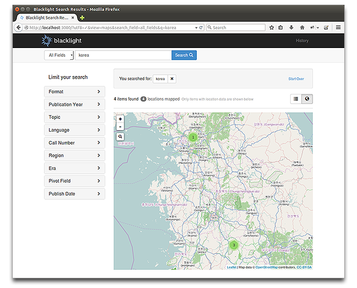

# Blacklight::Maps

[](https://travis-ci.org/sul-dlss/blacklight-maps)

Provides map views for Blacklight for items with geospatial coordinate (latitude/longitude) metadata.

Browse all records by 'Map' view:

Map results view for search results (coordinate data as facet):

Maplet widget in item detail view:


## Installation

Add this line to your application's Gemfile:

    gem 'blacklight-maps'

And then execute:

    $ bundle

Or install it yourself as:

    $ gem install blacklight-maps
    
Run Blacklight-Maps generator:
    
    $ rails g blacklight_maps:install

## Usage

Blacklight-Maps integrates [Leaflet](http://leafletjs.com/) to add map view capabilities for items with geospatial data in their corresponding Solr record.

In the map views, locations are represented as markers (or marker clusters, depending on the zoom level). Clicking on a marker opens a popup which (depending on config settings) displays the location name or coordinates, and provides a link to search for other items with the same location name/coordinates. 

In the catalog#map and catalog#index views, geospatial data comes from the facet component of the Solr response. Bounding boxes are represented as points corresponding to the center of the box.

In the catalog#show view, the data simply comes from the main document. Points are represented as markers and bounding boxes are represented as polygons. Clicking on a polygon open a popup that allows the user to search for any items intersecting the bounding box.

## Solr Requirements

Blacklight-Maps requires that your Solr index include at least one (but preferably BOTH) of the following two types of fields:

1. A `location_rpt` field that contains coordinates or a bounding box. For more on `location_rpt` see [Solr help](https://cwiki.apache.org/confluence/display/solr/Spatial+Search). This field can be multivalued.

```
  coordinates: 
   # coordinates: long lat
   - 78.96288 20.593684
   # bounding box: minX minY maxX maxY
   - 68.162386 6.7535159 97.395555 35.5044752       
```

2. An indexed, stored string field containing a properly-formatted [GeoJSON](http://geojson.org) feature object for a coordinate point or bounding box that represents the coordinates and (preferably) location name. This field can be multivalued.

```
  geojson_ssim:
   # coordinate point
   - {"type":"Feature","geometry":{"type":"Point","coordinates":[78.96288,20.593684]},"properties":{"placename":"India"}}
   # bounding box
   - {"type":"Feature","geometry":{"type":"Polygon","coordinates":[[[68.162386, 6.7535159], [97.395555, 6.7535159], [97.395555, 35.5044752], [68.162386, 35.5044752], [68.162386, 6.7535159]]]},"bbox":[68.162386, 6.7535159, 97.395555, 35.5044752]}
```

If you have #2 above and you want the popup search links to use the location name as a search parameter, you also need:

3. An indexed, stored text or string field containing location names. This field can be multivalued.

```
   placename_field: India
```

* GeoJSON (#2 above) allows you to associate place names with coordinates, so the map marker popups can display the location name
* Location names (#3 above) allow users to run meaningful searches for locations found on the map
* Coordinate data (#1 above) allows you to use the "Search" function on the map in the catalog#map and catalog#index views

Blacklight-Maps can be used with either field type, however to take advantage fo the full feature set, it is preferred that both field types exist for each item with geospatial metadata.

**Important:** If you are NOT using the geojson field (#2), you should create a `copyField` in your Solr schema.xml to copy the coordinates from the `location_rpt` field to a string field that is stored, indexed, and multivalued to allow for proper faceting of the coordinate values in the catalog#map and catalog#index views.

```
  <!-- Solr4 location_rpt field for coordinates, shapes, etc. -->
  <dynamicField name="geospatial" type="location_rpt" indexed="true" stored="true" multiValued="true" />
  <!-- copy geospatial to string field for faceting -->
  <copyField source="geospatial" dest="geospatial_facet" />
```

Support for additional field types may be added in the future.

### Configuration

#### Required
Blacklight-Maps expects you to provide:

+ `facet_mode`  = the type of field containing the data to use to display locations on the map (`geojson` or `coordinates`)
  - if `geojson`:
    + `geojson_field` = the name of the Solr field containing the GeoJSON data
+ `search_mode` = the type of search to run when clicking a link in the map popups (`placename` or `coordinates`)
  - if `placename`:
    + `placename_field` = the name of the Solr field containing the location names

If using GeoJSON:
+ `geojson_field` = the name of the SOlr field containing the GeoJSON data
If using location names


#### Optional

- the maxZoom [property of the map](http://leafletjs.com/reference.html#map-maxzoom)
- a [tileLayer url](http://leafletjs.com/reference.html#tilelayer-l.tilelayer) to change the basemap
- an [attribution string](http://leafletjs.com/reference.html#tilelayer-attribution) to describe the basemap layer
- a custom delimiter field (used to delimit placename_coord values)

All of these options can easily be configured in `CatalogController.rb` in the `config` block.

```
...
  configure_blacklight do |config|
    ## Default parameters to send to solr for all search-like requests. See also SolrHelper#solr_search_params
    config.default_solr_params = {
      :qt   => 'search',
      :rows => 10,
      :fl   => '*'
    }

    ## Default values
    config.view.maps.type = "bbox" # also accepts 'placename_coord' to use the placename coordinate type
    config.view.maps.bbox_field = "place_bbox"
    config.view.maps.placename_coord_field = "placename_coords"
    config.view.maps.tileurl = "http://{s}.tile.openstreetmap.org/{z}/{x}/{y}.png"
    config.view.maps.attribution = 'Map data &copy; <a href="http://openstreetmap.org">OpenStreetMap</a> contributors, <a href="http://creativecommons.org/licenses/by-sa/2.0/">CC-BY-SA</a>'
    config.view.maps.placename_coord_delimiter = '-|-'
...

```


## Contributing

1. Fork it ( http://github.com/<my-github-username>/blacklight-maps/fork )
2. Create your feature branch (`git checkout -b my-new-feature`)
3. Commit your changes (`git commit -am 'Add some feature'`)
4. Push to the branch (`git push origin my-new-feature`)
5. Create new Pull Request
